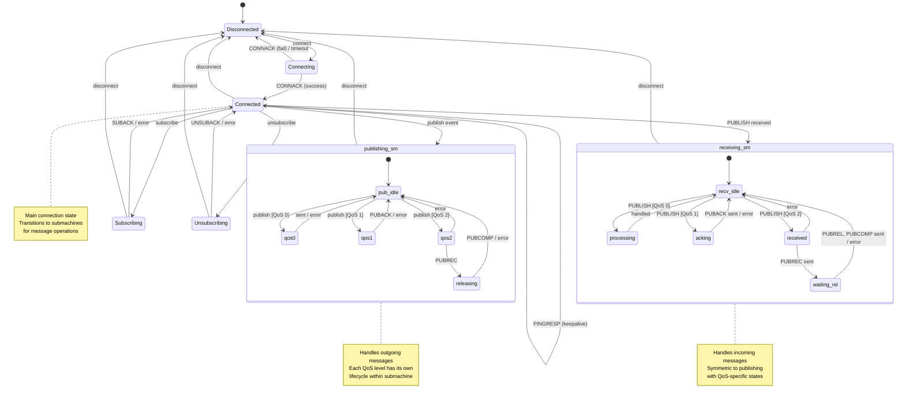

# A zephyr module implementing an MQTT client in C++ using boost::sml

[](STATUS.md)
[](LICENSE.md)
[](https://zephyrproject.org)
[](https://isocpp.org)

**[Status & Roadmap](STATUS.md)** | **[API Reference](QUICKREF.md)** | **[Implementation Details](IMPLEMENTATION.md)** | **[Testing Guide](test/README.md)**

## WARNING: Experimental - Not Production Ready

**This library is in early alpha development.** While the core implementation is complete, it has not undergone sufficient testing for production use. Only basic unit tests are passing; integration tests require MQTT broker setup and real hardware validation.

**Do not use in production systems without thorough testing and validation.**

## Overview

An experimental MQTT client library for Zephyr RTOS that uses Boost.SML (State Machine Language) for state management. The library provides both C++ and C APIs and targets MQTT v3.1.1 protocol support for resource-constrained embedded systems.

## Key Features (Implemented)

- **State Machine Based**: Uses Boost.SML for clean, verifiable state transitions
- **Embedded-Friendly**: Static memory allocation, configurable buffer sizes, noexcept guarantees
- **Dual API**: Native C++ and C wrapper for integration with C codebases
- **MQTT v3.1.1 Protocol**: QoS 0/1/2, retained messages, keepalive, clean session (implementation complete)
- **Multiple Connections**: Support for multiple simultaneous client instances
- **Event Callbacks**: State change and message received callbacks for C applications
- **Zero Dependencies**: Only requires Zephyr MQTT library and Boost.SML header

## Testing Status

PASSING (4 tests):
- Object creation and initialization
- Invalid parameter handling
- C API wrapper functionality

FAILING (19 tests - require broker):
- Connection establishment
- Publish/Subscribe operations
- QoS level handling
- Multiple client scenarios

UNTESTED:
- Real hardware deployment
- Long-term stability
- Error recovery paths
- Performance under load

## Architecture

The library implements the MQTT v3.1.1 protocol using a **hierarchical state machine** with composite submachines:

```
Main SM: Disconnected <-> Connecting <-> Connected
  ├─> publishing_sm (QoS-specific publish lifecycle)
  ├─> receiving_sm (QoS-specific receive lifecycle)
  ├─> Subscribing
  └─> Unsubscribing
```



### Hierarchical Architecture

**Main State Machine (mqtt_state_machine):**
- **Disconnected**: Initial state, no connection
- **Connecting**: TCP connected, waiting for CONNACK
- **Connected**: Session active, transitions to submachines for operations
- **Subscribing/Unsubscribing**: Subscription management

**Publishing Submachine (publishing_sm):**
- **pub_idle**: Ready to publish
- **qos0**: Fire-and-forget publish (QoS 0)
- **qos1**: At-least-once publish, waiting for PUBACK (QoS 1)
- **qos2**: Exactly-once publish, waiting for PUBREC (QoS 2)
- **releasing**: QoS 2 release phase, waiting for PUBCOMP

**Receiving Submachine (receiving_sm):**
- **recv_idle**: Ready to receive
- **processing**: Handling QoS 0 message (no ack)
- **acking**: Handling QoS 1 message, sending PUBACK
- **received**: Handling QoS 2 message, sending PUBREC
- **waiting_rel**: QoS 2 waiting for PUBREL, will send PUBCOMP

**Key Benefits:**
1. Each message type has its own lifecycle in dedicated submachine
2. Guards work correctly on runtime event data (QoS field)
3. Symmetric architecture for publishing and receiving
4. Clean separation of concerns
5. Error recovery isolated within each submachine
## Project Status

**Current Version:** 1.0.0 (March 2026)
**Status:** Production Ready

See [STATUS.md](STATUS.md) for:
- Development history and timeline
- Current features and limitations
- Roadmap for future versions
- Compatibility matrix
- Known issues and workarounds
## License

Copyright (c) 2025 Dean Sellers (dean@sellers.id.au)
SPDX-License-Identifier: MIT


## Adding to your Zephyr application

To use add the repository path to your west manifest file, probably `west.yml`. See the zephyr documentation on [project manifests](https://docs.zephyrproject.org/latest/develop/west/manifest.html#projects) for details.


``` yaml
  projects:
    - name: boost-sml
      url: https://github.com/boost-ext/sml.git
      revision: zephyr_module

    - name: sml-mqtt-cli
      url: http://your.git.server/sml-mqtt-cli
      revision: main
```

Then run `west update` to pull in the code. You need to then add the following config options to `prj.conf` or wherever you manage your configuration.

```
CONFIG_CPP=y
CONFIG_STD_CPP17=y
CONFIG_REQUIRES_FULL_LIBCPP=y

# Include boost sml state machine
CONFIG_LIB_BOOST_SML=y

# Include the zephyr MQTT library
CONFIG_MQTT_LIB=y

# Include the sml mqtt client
CONFIG_LIB_SML_MQTT_CLI=y

# Configure buffer sizes (optional, these are defaults)
CONFIG_SML_MQTT_CLI_RX_BUFFER_SIZE=256
CONFIG_SML_MQTT_CLI_TX_BUFFER_SIZE=256
CONFIG_SML_MQTT_CLI_MAX_PAYLOAD_LEN=512
CONFIG_SML_MQTT_CLI_MAX_TOPIC_LEN=128
CONFIG_SML_MQTT_CLI_MAX_SUBSCRIPTIONS=8
```

Then you can `#include <sml-mqtt-cli.hpp>` to use the library.

## Usage

### C++ API

```cpp
#include <sml-mqtt-cli.hpp>

using namespace sml_mqtt_cli;

// Create and initialize client
mqtt_client client;
client.init("my_device_001");

// Connect to broker
int ret = client.connect("mqtt.example.com", 1883, false);
if (ret != 0) {
    LOG_ERR("Failed to connect: %d", ret);
    return ret;
}

// Wait for connection
k_sleep(K_SECONDS(2));
client.input();  // Process CONNACK

// Publish a message
const char *topic = "sensors/temperature";
const char *payload = "{\"temp\": 22.5}";
ret = client.publish(topic, (const uint8_t*)payload, strlen(payload),
                     MQTT_QOS_0_AT_MOST_ONCE, false);

// Subscribe to a topic
ret = client.subscribe("commands/device001", MQTT_QOS_0_AT_MOST_ONCE);

// Main loop
while (client.is_connected()) {
    client.input();  // Process incoming messages
    client.live();   // Send keepalive if needed
    k_sleep(K_MSEC(100));
}

client.disconnect();
```

### C API

```c
#include <sml-mqtt-cli.hpp>

// Allocate storage for client (no heap allocation)
static uint8_t client_storage[sml_mqtt_client_get_size()] __attribute__((aligned(8)));
sml_mqtt_client_handle_t client = sml_mqtt_client_init_with_storage(client_storage, sizeof(client_storage));

if (!client) {
    // Handle error
}

sml_mqtt_client_init(client, "my_device_001");

// Connect
int ret = sml_mqtt_client_connect(client, "mqtt.example.com", 1883, false);

// Publish
const char *topic = "sensors/temperature";
const char *payload = "{\"temp\": 22.5}";
ret = sml_mqtt_client_publish(client, topic, (const uint8_t*)payload,
                              strlen(payload), MQTT_QOS_0_AT_MOST_ONCE, false);

// Subscribe with callback
void on_message(void *user_data, const char *topic,
                const uint8_t *payload, size_t len, enum mqtt_qos qos) {
    printk("Received on %s: %.*s\n", topic, (int)len, payload);
}

sml_mqtt_client_set_publish_received_callback(client, on_message, NULL);
sml_mqtt_client_subscribe(client, "commands/#", MQTT_QOS_0_AT_MOST_ONCE);

// Process loop
while (sml_mqtt_client_is_connected(client)) {
    sml_mqtt_client_input(client);
    sml_mqtt_client_live(client);
    k_sleep(K_MSEC(100));
}

// Cleanup (does not free storage)
sml_mqtt_client_disconnect(client);
sml_mqtt_client_deinit(client);
// client_storage remains allocated on stack or in static memory
```

### Multiple Connections

```cpp
// Create multiple clients for different purposes
mqtt_client sensor_client;
mqtt_client command_client;

sensor_client.init("device001_sensors");
command_client.init("device001_commands");

sensor_client.connect("sensors.example.com", 1883, false);
command_client.connect("commands.example.com", 1883, true);  // TLS

// Use independently
sensor_client.publish("temp/living_room", data, len, MQTT_QOS_0_AT_MOST_ONCE, false);
command_client.subscribe("commands/device001/#", MQTT_QOS_1_AT_LEAST_ONCE);
```

## Configuration Options

All buffer sizes and limits are configurable via Kconfig:

| Option | Default | Description |
|--------|---------|-------------|
| `CONFIG_SML_MQTT_CLI_MAX_TOPIC_LEN` | 128 | Maximum topic string length |
| `CONFIG_SML_MQTT_CLI_MAX_PAYLOAD_LEN` | 512 | Maximum payload size |
| `CONFIG_SML_MQTT_CLI_MAX_CLIENT_ID_LEN` | 64 | Maximum client ID length |
| `CONFIG_SML_MQTT_CLI_RX_BUFFER_SIZE` | 256 | MQTT RX buffer size |
| `CONFIG_SML_MQTT_CLI_TX_BUFFER_SIZE` | 256 | MQTT TX buffer size |
| `CONFIG_SML_MQTT_CLI_MAX_SUBSCRIPTIONS` | 8 | Max concurrent subscriptions |
| `CONFIG_SML_MQTT_CLI_CONNECT_TIMEOUT_MS` | 5000 | Connection timeout |
| `CONFIG_SML_MQTT_CLI_KEEPALIVE_SEC` | 60 | Keepalive interval |

## Memory Footprint

Typical RAM usage per client instance (default configuration):
- Base structure: ~200 bytes
- RX buffer: 256 bytes
- TX buffer: 256 bytes
- Topic/payload buffers: 640 bytes
- Subscriptions: 8 x 132 = 1056 bytes
- **Total**: ~2.4 KB per client

Reduce footprint by adjusting Kconfig options based on your needs.

## Testing

Comprehensive test suite included in `test/` directory. See [test/README.md](test/README.md) for details.

```bash
cd test
west build -p always -b qemu_x86
west build -t run
```

Tests require an MQTT broker on `localhost:8883` (configurable).

## State Machine Flows

The library implements these state transition flows:

- **Connection**: Disconnected -> Connecting -> Connected
- **Publishing QoS 0**: Connected -> Publishing_QoS0 -> Connected
- **Publishing QoS 1**: Connected -> Publishing_QoS1 -> [receive PUBACK] -> Connected
- **Publishing QoS 2**: Connected -> Publishing_QoS2 -> [receive PUBREC] -> PubRel_Sent -> [receive PUBCOMP] -> Connected
- **Receiving QoS 0**: Connected -> [handle message] -> Connected (internal transition)
- **Receiving QoS 1**: Connected -> [handle message, send PUBACK] -> Connected (internal transition)
- **Receiving QoS 2**: Connected -> [receive PUBLISH, send PUBREC] -> PubRec_Sent_Rx -> [receive PUBREL, send PUBCOMP] -> Connected
- **Subscribing**: Connected -> Subscribing -> [receive SUBACK] -> Connected
- **Unsubscribing**: Connected -> Unsubscribing -> [receive UNSUBACK] -> Connected
- **Error Recovery**: All intermediate states -> [send_error] -> Connected

**Note:** QoS 0/1 receiving uses internal transitions (no state changes) because these are single-step operations that complete immediately. Only QoS 2 (exactly-once delivery) requires multi-step acknowledgment flows with intermediate states. Publishing operations all have explicit states because we initiate them and need to track our own protocol state through completion.

## Error Handling

All functions return standard errno codes:
- `0`: Success
- `-EINVAL`: Invalid parameter
- `-ENOTCONN`: Not connected
- `-EHOSTUNREACH`: Cannot reach broker
- `-EMSGSIZE`: Message too large
- `-ENOMEM`: Out of resources (e.g., subscriptions)
- `-ENOENT`: Item not found

### Protocol Error Recovery

The state machine automatically handles protocol-level send errors:
- If PUBACK/PUBREC/PUBREL/PUBCOMP sending fails, the state machine
  returns to Connected state
- The error is logged with details
- Pending operations are reset
- The client can retry the operation

For QoS 1/2 messages, if acknowledgment sending fails:
- The broker may retransmit the message
- The application should handle duplicate deliveries
- Use message IDs to detect duplicates if needed

## Thread Safety

**Not thread-safe**: Each `mqtt_client` instance should be used from a single thread. For multi-threaded applications, use one client per thread or add external synchronization.

## Limitations

- MQTT v3.1.1 only (v5.0 not supported due to Zephyr dependency)
- Clean session only (persistent sessions not implemented)
- No automatic reconnection (application must handle)
- No offline message queueing (messages sent only when connected)
- Max message size limited by configured buffers

## Examples

See the test suite in `test/src/` for comprehensive examples:
- `test_basic_connection.cpp`: Connection handling
- `test_publish_subscribe.cpp`: Pub/sub operations
- `test_qos_levels.cpp`: QoS 0/1/2 usage
- `test_multiple_clients.cpp`: Multiple connections, reconnection

## Contributing

Contributions welcome! Please ensure:
- Code follows Zephyr coding style
- All functions are `noexcept`
- Static allocation is used (no heap)
- Tests pass for your changes
- Documentation is updated

## Project Documentation

- **[STATUS.md](STATUS.md)** - Project status, roadmap, and compatibility matrix
- **[QUICKREF.md](QUICKREF.md)** - Quick API reference
- **[IMPLEMENTATION.md](IMPLEMENTATION.md)** - Design decisions and architecture
- **[test/README.md](test/README.md)** - Testing guide and setup
- **[example_usage.cpp](example_usage.cpp)** - Standalone example application

## External References

- [Zephyr MQTT Documentation](https://docs.zephyrproject.org/latest/connectivity/networking/api/mqtt.html)
- [Boost.SML Documentation](https://boost-ext.github.io/sml/)
- [MQTT v3.1.1 Specification](https://docs.oasis-open.org/mqtt/mqtt/v3.1.1/mqtt-v3.1.1.html)
